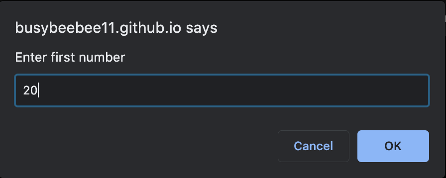
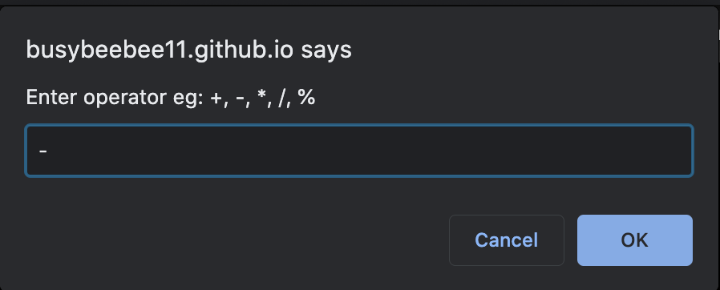
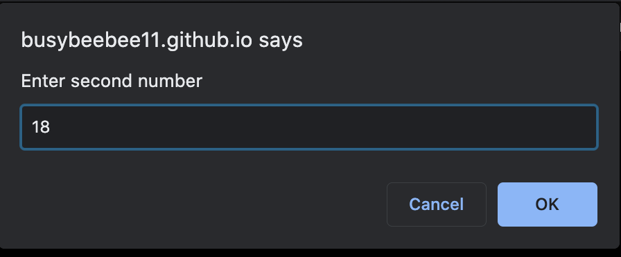
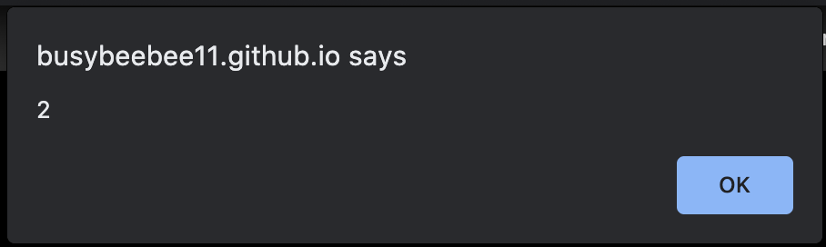

## JS CALCULATOR TASK
---
 ### The task was to create a simple calculator without frontend.
---
LANGUAGE USED
### JS 
---
## HOSTED PAGE
[https://busybeebee11.github.io/JS-calculator-task/]
---
---
## RESOURCES
* Youtube
[https://www.youtube.com/watch?v=O8c_L2G8bsQ]
[https://www.youtube.com/watch?v=8vNc6RsKCno]
---
## ANOWLEDGEMENT
* God
* Zuri
---
## PREVIEW

